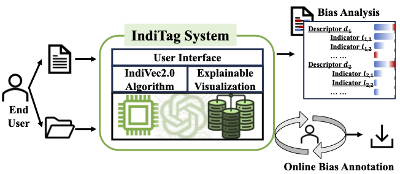

# IndiTag

IndiTag is an innovative online media bias analysis and annotation system that leverages fine-grained bias indicators to dissect and annotate bias in digital content. 
Users can input text directly into the textbox or upload a file for analysis. The analysis result displays several descriptors based on the provided content, each accompanied by matched indicators and a bar graph indicating the percentage towards 'left', 'center', and 'right'.
For more details about our indicators database, please refer to the paper [IndiVec](https://arxiv.org/abs/2402.00345), and [IndiTag](https://arxiv.org/abs/2403.13446) about this demo.

## Introduction
1. Explainable Bias Matching Mechanism and Results Downloads
- Once the analysis is complete, view the results to see the generated descriptors and their corresponding bias levels.
- Click on each descriptor to view matching indicators and mapping parts of the original article. The length of the bar for each indicator represents the similarity score between the indicator and the descriptor.
- Comments can be added and saved together with the analysis result in JSON format.
2. Support for Additional Customized Mapping
- The module 'Mapping' introduces an additional feature enabling users to input personalized descriptors and articles to analyze the article from the user’s perspective.

## Installation

1. Clone the repository

2. Install dependencies and download the media bias indicators database here:
 https://drive.google.com/file/d/1Wv4gVpLa_IoEAsSG0ydDIz0VINx-vTY5/view?usp=sharing

3. Run the application

## More Details
- @article{lin2024indivec,
  title={IndiVec: An Exploration of Leveraging Large Language Models for Media Bias Detection with Fine-Grained Bias Indicators},
  author={Lin, Luyang and Wang, Lingzhi and Zhao, Xiaoyan and Li, Jing and Wong, Kam-Fai},
  journal={arXiv preprint arXiv:2402.00345},
  year={2024}
}
- @article{lin2024inditag,
  title={IndiTag: An Online Media Bias Analysis and Annotation System Using Fine-Grained Bias Indicators},
  author={Lin, Luyang and Wang, Lingzhi and Guo, Jinsong and Li, Jing and Wong, Kam-Fai},
  journal={arXiv preprint arXiv:2403.13446},
  year={2024}
}
